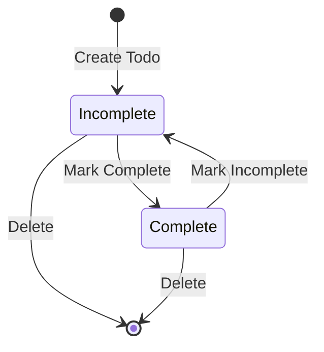

# Data Model: Phase II - Full-Stack Web Todo Application

**Date**: 2026-01-18
**Feature**: Phase II - Full-Stack Web Todo Application
**Branch**: phase-ii-fullstack-web-app

## Todo Entity

**Definition**: Represents a single todo item in the system with persistent storage in Neon PostgreSQL

**Fields**:
- `id`: Integer - Unique identifier for the todo (auto-generated primary key)
- `title`: String (max 200) - Title of the todo (required)
- `description`: String (max 2000) - Detailed description of the todo (optional)
- `completed`: Boolean - Completion status of the todo (default: false)
- `created_at`: DateTime - Timestamp when the todo was created (auto-generated)
- `updated_at`: DateTime - Timestamp when the todo was last updated (auto-generated)
- `user_id`: String - Foreign key linking to user (required for multi-user support in future phases)

**Validation Rules**:
- `id` must be unique within the system (primary key constraint)
- `title` must be between 1 and 200 characters
- `title` must not be empty after trimming whitespace
- `description` can be null or between 0 and 2000 characters
- `completed` must be boolean type
- `created_at` is set once at creation and never updated
- `updated_at` is updated on every modification
- `user_id` must reference a valid user in the users table (when authentication is implemented)

**State Transitions**:
- `incomplete` → `complete` (when user marks todo as complete)
- `complete` → `incomplete` (when user marks todo as incomplete)

## TodoList Entity

**Definition**: Virtual collection representing all todos in the system, managed by the database with filtering capabilities

**Operations**:
- Add new todo to the collection
- Retrieve all todos (with optional filters)
- Retrieve single todo by ID
- Update existing todo in the collection
- Delete todo from the collection
- Filter todos by completion status
- Sort todos by creation date (newest first)

**Validation Rules**:
- All todos must have valid user_id references (when authentication is implemented)
- No duplicate todos allowed (enforced by database constraints)
- Referential integrity maintained through foreign keys

---

## Database Schema

### Table: `todos`

| Column       | Type      | Constraints                  | Purpose                          |
|--------------|-----------|------------------------------|----------------------------------|
| id           | INTEGER   | PRIMARY KEY, AUTO_INCREMENT  | Unique identifier (surrogate key)|
| user_id      | VARCHAR   | FOREIGN KEY, INDEXED          | Links to user (Better Auth ID)   |
| title        | VARCHAR   | NOT NULL, MAX LENGTH 200, INDEXED | Todo title text              |
| description  | TEXT      | NULLABLE                     | Optional detailed notes          |
| completed    | BOOLEAN   | NOT NULL, DEFAULT FALSE      | Completion status                |
| created_at   | TIMESTAMP | NOT NULL, DEFAULT CURRENT    | Creation timestamp (UTC)         |
| updated_at   | TIMESTAMP | NOT NULL, DEFAULT CURRENT, ON UPDATE CURRENT | Last modification timestamp |

**Indexing Strategy**:
- Primary key on `id` (automatic)
- Index on `user_id` for efficient user-based queries
- Index on `completed` for filtering by status
- Composite index on `(user_id, completed)` for common user-status queries
- Index on `created_at` for chronological ordering

**Relationships**:
- `todos.user_id` → `users.id` (foreign key to Better Auth users table)

### Field Design Decisions

- **id**: Auto-incrementing integer (simpler than UUID for single-database setup)
  - Rationale: Efficient indexing, simpler queries, sufficient for single-database application
  - Alternative considered: UUID v4 (rejected for database efficiency in Phase II)

- **user_id**: String (VARCHAR) to match Better Auth user ID format
  - Rationale: Compatible with Better Auth library's user ID format
  - Stored as received from authentication provider

- **title**: Variable-length string with 200 char limit
  - Stored trimmed (whitespace removed from start/end at service layer)
  - Enforced at both service and database layer

- **description**: Unlimited text field (TEXT type)
  - Nullable to differentiate between empty string and no description
  - Stored as-is (whitespace preserved)

- **completed**: Boolean flag with default false
  - Only two states: true (completed) or false (incomplete)
  - Indexed for efficient filtering

- **created_at**: Immutable timestamp
  - Set once at creation, never updated
  - Stored in UTC to avoid timezone issues
  - Used for default sort order (newest first)

- **updated_at**: Mutable timestamp
  - Updated on every modification
  - Used for tracking last activity
  - Stored in UTC to avoid timezone issues

## API Data Transfer Objects

### TodoCreate DTO
**Purpose**: Data transfer object for creating new todos
- `title: string` (required, 1-200 chars)
- `description: string | null` (optional, 0-2000 chars)

### TodoUpdate DTO
**Purpose**: Data transfer object for updating existing todos
- `title?: string` (optional, 1-200 chars if provided)
- `description?: string | null` (optional, 0-2000 chars if provided)
- `completed?: boolean` (optional, true/false if provided)

### TodoResponse DTO
**Purpose**: Data transfer object for returning todo data to clients
- `id: number` (read-only, assigned by database)
- `title: string` (read-only after creation in this phase)
- `description: string | null` (can be null)
- `completed: boolean` (current status)
- `created_at: string` (ISO 8601 datetime format)
- `updated_at: string` (ISO 8601 datetime format)

---

## State Transition Diagram

**Notes**:
- Creation always starts in "Incomplete" state
- Deletion is permanent (no soft delete in Phase II)
- Completion status can toggle freely between states
- Only authenticated users can modify their own todos (enforced at API layer)

## Validation Rules Summary

### At Database Layer
- NOT NULL constraints on required fields
- Length constraints via VARCHAR limits
- Foreign key constraints to ensure data integrity
- Unique constraints where appropriate

### At Service Layer
- Input trimming and sanitization
- Business rule validation (e.g., non-empty titles)
- User ownership verification (when authentication implemented)

### At API Layer
- Request schema validation via Pydantic
- Authentication and authorization checks
- Rate limiting for API endpoints

### At Frontend Layer
- Client-side validation for immediate feedback
- Input sanitization before sending to API
- Error handling and user-friendly messages

## Migration Strategy

**Initial Setup**:
- Use SQLModel's `create_all()` for initial schema creation
- Leverage Neon PostgreSQL's migration capabilities for future changes
- Store schema version in a dedicated table for consistency checks

**Future Changes**:
- Use Alembic for database migrations in later phases
- Implement zero-downtime deployment patterns
- Maintain backward compatibility during schema evolution

## Performance Considerations

**Query Optimization**:
- Indexes on frequently queried columns (user_id, completed, created_at)
- Efficient pagination for large todo lists
- Connection pooling for database operations

**Data Growth**:
- Phase II designed for single-user scale (hundreds to thousands of todos)
- Ready for multi-user scale with proper indexing
- Prepared for advanced features (tags, categories, due dates) in Phase V

**Caching Strategy**:
- Database-level caching via PostgreSQL
- Application-level caching to be implemented in Phase IV
- CDN caching for static assets via Next.js